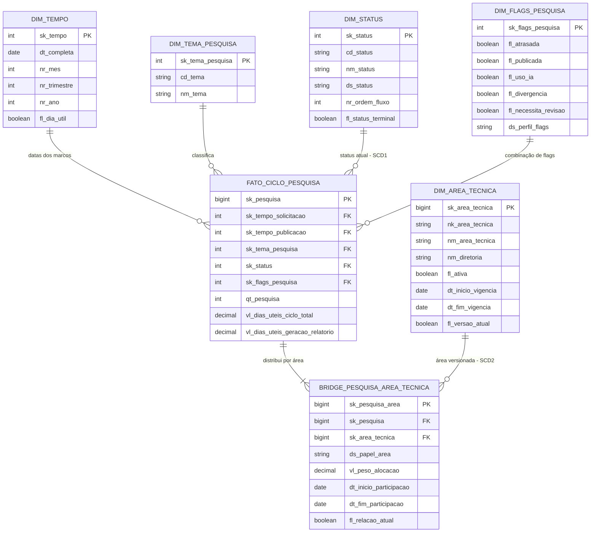

# Ponderada em Sala — Bridge Tables, Junk Dimensions e SCD

**Aluno:** Rafael Furtado  
**Projeto de referência:** G01 — Central de Pesquisas do Sindusfarma  
**Cubo selecionado:** Cubo 1 — Ciclo de Vida da Pesquisa  
**Interação com IA Generativa:** [registro da interação e reconstrução pedagógica do debate](./INTERACAO_IA.MD)

## 1. Contexto e pergunta analítica

Esta proposta parte do Data Model Canvas vigente do projeto G01, no qual o Cubo 1 acompanha o ciclo completo de uma pesquisa. Seu grão é **uma linha por pesquisa**, implementada como uma tabela fato do tipo *accumulating snapshot*: a linha nasce na solicitação e recebe os marcos de planejamento, coleta, relatório e publicação à medida que o processo avança.

A pergunta analítica que orienta as decisões deste documento é:

> **Como o volume, o tempo de ciclo e o cumprimento de SLA variam por área técnica ao longo do tempo, inclusive quando uma mesma pesquisa envolve mais de uma área, sem duplicar pesquisas nem reescrever a estrutura organizacional histórica?**

Ela combina perguntas já cobertas pelo projeto: volume por área (P03), tempo entre marcos (P16), prorrogações (P18) e evolução do volume por área (P20). A solução mantém o grão original da fato e acrescenta três recursos de modelagem dimensional: uma bridge table para o relacionamento muitos-para-muitos, uma junk dimension para flags de baixa cardinalidade e políticas SCD escolhidas de acordo com o uso analítico de cada dimensão.

## 2. Grão e medidas preservados

A tabela `fato_ciclo_pesquisa` continua tendo exatamente uma linha por `sk_pesquisa`. Não será criada uma linha por etapa nem uma linha por área, pois isso repetiria as medidas da pesquisa e inflaria contagens e durações.

Principais medidas utilizadas:

| Medida | Regra de agregação |
| :-- | :-- |
| `qt_pesquisa` | Valor constante 1; aditiva fora da bridge e alocada por peso quando agrupada por área |
| `vl_dias_uteis_ciclo_total` | Não aditiva; utilizar média ou média ponderada, nunca soma como indicador de duração |
| `vl_dias_uteis_geracao_relatorio` | Não aditiva; utilizar média ou percentis |
| `fl_dentro_sla` | Recalcular a taxa como razão entre pesquisas dentro do SLA e pesquisas elegíveis |

## 3. Bridge table: pesquisa × área técnica

### 3.1 Relacionamento muitos-para-muitos

Uma pesquisa pode exigir validação e acompanhamento de **uma ou mais áreas técnicas**, enquanto cada área participa de várias pesquisas. Colocar apenas `sk_area_tecnica` na fato obrigaria a escolher uma única área. Duplicar a linha da fato para cada área quebraria o grão e repetiria todas as medidas. A solução é a `bridge_pesquisa_area_tecnica`.

| Coluna | Tipo lógico | Regra |
| :-- | :-- | :-- |
| `sk_pesquisa_area` | bigint | Chave substituta da relação |
| `sk_pesquisa` | bigint | FK para a única linha da pesquisa na fato |
| `sk_area_tecnica` | bigint | FK para a versão SCD 2 da área |
| `ds_papel_area` | varchar | Papel na pesquisa: responsável, validadora ou apoio |
| `vl_peso_alocacao` | decimal(9,6) | Fração da pesquisa atribuída à área, entre 0 e 1 |
| `dt_inicio_participacao` | date | Início da participação da área |
| `dt_fim_participacao` | date | Fim da participação, nula enquanto vigente |
| `fl_relacao_atual` | boolean | Indica a relação vigente na carga atual |

Para cada pesquisa, a soma dos pesos das relações consideradas na análise deve ser 1, com tolerância apenas para arredondamento:

```text
SUM(vl_peso_alocacao) por sk_pesquisa = 1,000000
```

O peso deve vir de uma regra de responsabilidade definida pelo negócio. Enquanto a origem não trouxer percentuais, aplica-se provisoriamente `1 / quantidade_de_areas`, deixando essa premissa registrada na linhagem da carga. Se houver apenas uma área, o peso será 1.

Exemplo: se a pesquisa P-101 tiver participação de Sindical/RH com peso 0,60 e Assuntos Técnicos com peso 0,40, a contagem alocada será 0,60 e 0,40, totalizando uma pesquisa. Uma contagem inclusiva com `COUNT(DISTINCT sk_pesquisa)` também pode ser oferecida, mas ela responde “em quantas pesquisas a área participou” e, por definição, não é reconciliável pela soma entre áreas.

Para calcular o tempo médio de ciclo por área sem dar peso duplo a uma pesquisa multiárea:

```sql
SUM(f.vl_dias_uteis_ciclo_total * b.vl_peso_alocacao)
    / NULLIF(SUM(b.vl_peso_alocacao), 0)
```

## 4. Junk dimension: flags da pesquisa

Os atributos `fl_atrasada`, `fl_publicada`, `fl_uso_ia`, `fl_divergencia` e `fl_necessita_revisao` têm baixa cardinalidade, são descritivos e aparecem juntos nos filtros operacionais. Em vez de mantê-los como cinco dimensões minúsculas ou espalhá-los pela fato, eles serão agrupados na `dim_flags_pesquisa`.

| Coluna | Tipo lógico | Descrição |
| :-- | :-- | :-- |
| `sk_flags_pesquisa` | smallint | Chave substituta usada pela fato |
| `fl_atrasada` | boolean | Prazo ultrapassado e pesquisa ainda não concluída no momento da carga |
| `fl_publicada` | boolean | Resultado publicado no acervo |
| `fl_uso_ia` | boolean | Processo registrou apoio de IA |
| `fl_divergencia` | boolean | Há divergência de dados ou validação |
| `fl_necessita_revisao` | boolean | Existe revisão pendente |
| `ds_perfil_flags` | varchar | Rótulo legível da combinação, sem lógica adicional |

Com cinco flags existem no máximo 32 combinações teóricas. Serão carregadas apenas combinações válidas e observadas, além do membro desconhecido `-1`. A tupla dos cinco flags terá restrição de unicidade, garantindo que uma combinação sempre resolva para a mesma chave substituta.

Regras mínimas de consistência:

- `fl_publicada = true` exige data de publicação preenchida;
- `fl_atrasada` é derivada da data-limite, dos marcos e do status, e não digitada livremente;
- valor ausente não é convertido automaticamente em `false`; ele aponta para o membro desconhecido;
- texto livre, datas e motivos de divergência não entram na junk dimension, pois não têm baixa cardinalidade.

Como a fato é um *accumulating snapshot*, sua FK `sk_flags_pesquisa` pode mudar durante o ciclo. A junk dimension descreve a combinação corrente; ela não substitui o Cubo 4, que registra historicamente o estado mensal do pipeline.

## 5. Estratégias SCD

### 5.1 `dim_area_tecnica`: SCD tipo 2

A dimensão de área técnica usará **SCD tipo 2** para preservar a estrutura organizacional válida em cada período.

| Coluna | Função |
| :-- | :-- |
| `sk_area_tecnica` | Chave substituta de cada versão |
| `nk_area_tecnica` | Identificador estável da área no sistema de origem |
| `nm_area_tecnica` | Nome apresentado ao usuário |
| `nm_diretoria` | Agrupamento organizacional da área |
| `fl_ativa` | Situação da área naquela versão |
| `dt_inicio_vigencia` | Início inclusivo da versão |
| `dt_fim_vigencia` | Fim exclusivo; `9999-12-31` na versão atual |
| `fl_versao_atual` | Facilita consultas do estado corrente |

**Justificativa analítica:** P03 e P20 comparam volume por área ao longo do tempo. Se uma área for renomeada, desmembrada ou movida de diretoria, sobrescrever a dimensão faria pesquisas antigas aparecerem sob a estrutura atual. O tipo 2 mantém a leitura “como era na época” e permite, em uma visão separada, reagrupar versões pela `nk_area_tecnica` quando o usuário quiser a estrutura atual.

Na carga, uma alteração relevante encerra a versão anterior e cria uma nova `sk_area_tecnica`. Correção de grafia sem mudança semântica pode ser tratada como correção tipo 1, mediante regra de qualidade registrada. A bridge referencia a versão válida na data de início da participação da área.

### 5.2 `dim_status`: SCD tipo 1

A `dim_status` usará **SCD tipo 1** para descrições e metadados do domínio, mantendo uma chave por código canônico de status.

| Coluna | Função |
| :-- | :-- |
| `sk_status` | Chave substituta estável |
| `cd_status` | Código canônico do domínio |
| `nm_status` | Nome exibido |
| `ds_status` | Definição operacional |
| `nr_ordem_fluxo` | Ordem padrão de apresentação |
| `fl_status_terminal` | Indica encerramento do fluxo |

**Justificativa analítica:** a pergunta precisa do status operacional atual e dos marcos do ciclo. A passagem de “Em andamento” para “Finalizada” não é mudança descritiva da dimensão; é uma mudança do processo representado pela fato, cuja FK é atualizada. Criar uma nova versão da dimensão a cada transição confundiria evento de negócio com manutenção dimensional. Alterações de rótulo, descrição ou ordem são sobrescritas em tipo 1. Quando a análise exigir o status que vigorava em cada mês, a fonte correta é o Cubo 4 (`fato_pipeline_mensal`), não uma SCD 2 artificial em `dim_status`.

O tipo 3 não foi adotado porque guardar somente valor atual e anterior não atende reorganizações sucessivas da área e não acrescenta valor ao domínio controlado de status.

## 6. Diagrama da solução



## 7. Fluxo de carga

1. Normalizar códigos, datas e domínios das fontes Trello, formulário, SurveyMonkey e planilhas internas.
2. Aplicar SCD 2 em `dim_area_tecnica`: detectar mudança semântica, encerrar a versão anterior e inserir a nova.
3. Aplicar SCD 1 em `dim_status`: atualizar descrições do código canônico sem criar versões históricas.
4. Resolver as áreas de cada pesquisa e carregar a bridge. Percentuais informados têm prioridade; na ausência deles, usar divisão igualitária documentada.
5. Derivar os cinco flags, localizar ou inserir a combinação na junk dimension e obter `sk_flags_pesquisa`.
6. Inserir ou atualizar a única linha de `fato_ciclo_pesquisa`, preservando todos os marcos já conhecidos.
7. Registrar arquivo, instante de extração, versão das regras e resultado das validações em `dim_execucao_carga`.

## 8. Testes de qualidade

| Teste | Resultado esperado |
| :-- | :-- |
| Unicidade da fato | Uma linha por `sk_pesquisa` |
| Integridade da bridge | Nenhuma FK órfã para pesquisa ou área |
| Peso da bridge | Soma igual a 1 por pesquisa no conjunto de relações usado para alocação |
| SCD 2 de área | Uma única versão atual por `nk_area_tecnica` e nenhum intervalo sobreposto |
| Junk dimension | Uma chave por combinação de flags; membro `-1` para desconhecido |
| Publicação | `fl_publicada = true` somente com marco de publicação válido |
| Reconciliação | Soma de `qt_pesquisa * vl_peso_alocacao` por todas as áreas igual ao total de pesquisas |

## 9. Limitações e decisões abertas

A extração atual pode registrar apenas a área principal em parte das pesquisas. Nesses casos, a bridge começa com uma relação de peso 1; o modelo já suporta múltiplas áreas quando a origem passar a fornecê-las. O rateio igualitário é uma regra provisória, não uma afirmação de esforço real, e deve ser substituído por percentuais validados pelo parceiro.

As flags da junk dimension representam o estado corrente do *accumulating snapshot*. Evolução mensal de atraso ou status deve ser consultada no Cubo 4. Por fim, medidas de duração continuam não aditivas: o peso evita duplicidade entre áreas, mas não transforma dias em uma medida somável.

## 10. Atendimento aos critérios de avaliação

| Critério | Evidência nesta entrega |
| :-- | :-- |
| Bridge table | `bridge_pesquisa_area_tecnica`, com colunas, papéis, vigência e peso de alocação |
| Junk dimension | `dim_flags_pesquisa`, com chave substituta e cinco atributos de baixa cardinalidade |
| SCD em duas dimensões | Tipo 2 para `dim_area_tecnica` e tipo 1 para `dim_status`, ambos derivados da pergunta analítica |
| Diagrama visual | Diagrama Mermaid da seção 6, incluindo fato, bridge, junk e dimensões SCD |

## Referência utilizada

Modelo do projeto G01 consultado no commit `19baeba`, especialmente `docs/dmc.json`, `modelos/dw_cubo_1.mmd`, `docs/sprint-1/modelagem_conceitual.md` e `docs/sprint-1/cubos-cobertura-perguntas.md`.
